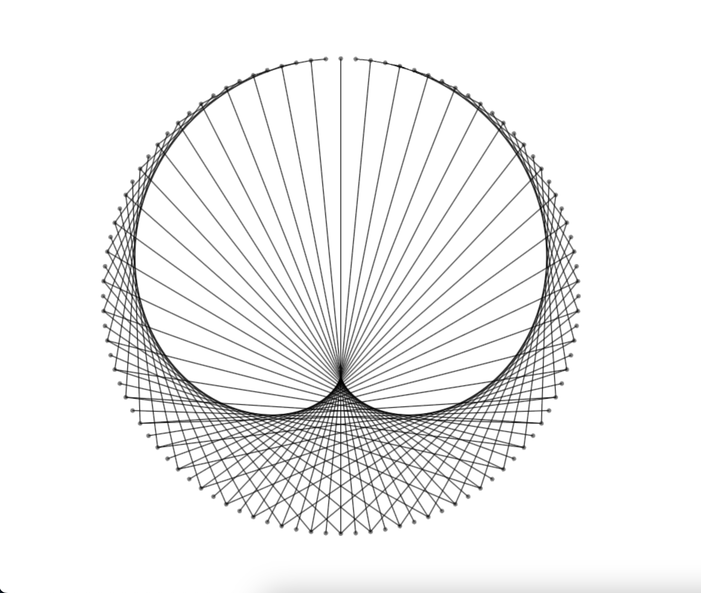

# Modular Multiplication Circle Demo

This project consists of a single HTML file, `demo.html`, which creates an interactive animation of patterns given by secant lines within a regular circle. The animation allows users to control the number and arrangement of circles, as well as animate the pattern by changing a modulus number.

## Getting Started

To run the project, simply open the `demo.html` file in a web browser. The animation will be displayed on the canvas within the browser window.

## Demo Link	

Enjoy the quick demo [here](https://rawgit.com/johnlk/modMultiplicationCircle/master/demo.html)
